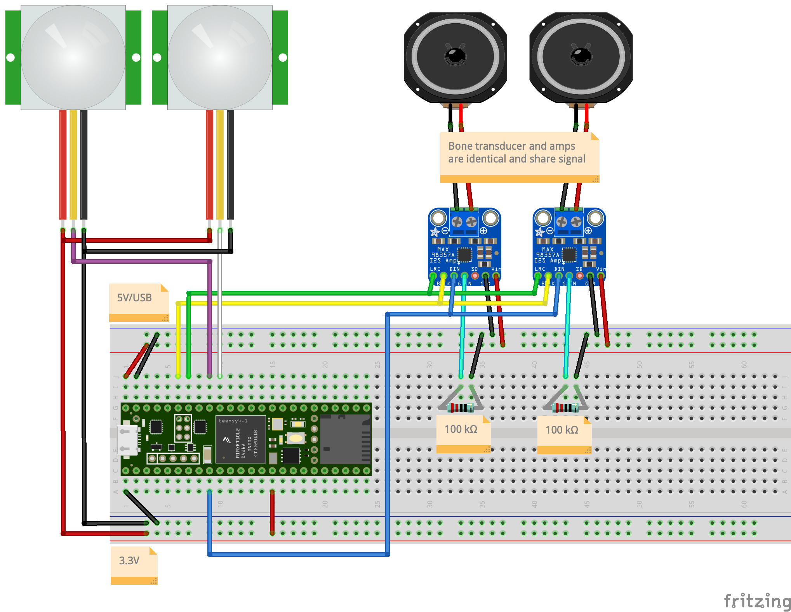

# Earth Wear User Guide

This project was created for an art installation by artist [Angie Eng](https://angieeng.com). The material here can be readily reused for other motion-sensing and sound-playing projects based on Arduino.

## Behavior

Either of two IR motion detectors can trigger sounds to be played through the surface transducer(s). Any detected motion will play the first audio file. When the first audio file finishes playing it will play the second if motion is detected at that time, and so on, until all of the files have been played. Once playback stops because of no motion, the first audio clip will be played for the next activation.

## Breadboard Wiring Diagram



Diagram created with Fritzing from [this file](EarthWear.fzz).

## IR Sensitivity

Each IR sensor has `OSC` and `SEN` dials. Turning `OSC` clockwise will make the sensor stay triggered for longer when it detects motion. Turning `SEN` clockwise increases the sensitiity of the sensor. These are changed by turning tiny screw-like faces that require a jeweler's screwdriver.

## Audio Files

The sound files are saved on a 1GB microSD card that is inserted into the microcontroller. The files must be `.WAV` with a sample rate of 44.1 kHz and 16 bit resolution. It is fairly safe to assume a WAV file will have the right resolution but sample rate can vary. This can be fixed with the command line tool `FFMPEG` and the command `ffmpeg -i ORIGINAL.WAV -ar 44100 -y OUTPUT.WAV`. The filenames have to follow a few rules (`uppercase 8.3`) but my thought is to save yourself the trouble of figuring that out and just use an "all uppercase, no spaces, only letters and numbers" rule. 

The files that get played can be customized by changing this section of code in the Arduino sketch:

```cpp

void loop() {
  if (isActive()) {playFile("LION.WAV");}
  if (isActive()) {playFile("CATTLE.WAV");}
  if (isActive()) {playFile("OWL2.WAV");}
  delay(100);
}

```

You can simply add or remove the lines with filenames in them to affect the order and total number of files.

The placeholder WAV files came from https://soundbible.com/tags-animal.html. 

## Code Changes

This project uses a Teensyduino 4.1, which requires a specialized version of the Arduino software, available form the PJRC website for Teensyduino. 

This code is based off of an [example from `PaulStoffregen`](https://github.com/PaulStoffregen/Audio/blob/master/examples/WavFilePlayer/WavFilePlayer.ino) on GitHub.

## Power

It is easiest to run the Teensyduino through the USB micro-B port and this will then distribute power to the other components. The power can come from a USB battery pack or a standard "wall wart" power supply. Depending on the setup, the speakers might pull several Watts if they are both running and in this case it would make sense to find a power supply that can handle more power than, say, the basic one that used to come with iPhone. 

## Components
- [Teensydiuno 4.1](https://www.pjrc.com/store/teensy41.html)
- [SparkFun OpenPIR](https://www.sparkfun.com/products/13968) motion sensor
- [I2S Amplifier 3.2W](https://www.sparkfun.com/products/14809)
- [Large Surface Transducer](https://www.sparkfun.com/products/10975)
- [microSD Card - 1GB (Class 4)](https://www.sparkfun.com/products/15107)

## Noted Problems

I struggled for far too long to get either or both of SD card reading and speaker driving with a MKR ZERO and with an ESP32 Thing Plus. Why? I do not know. 